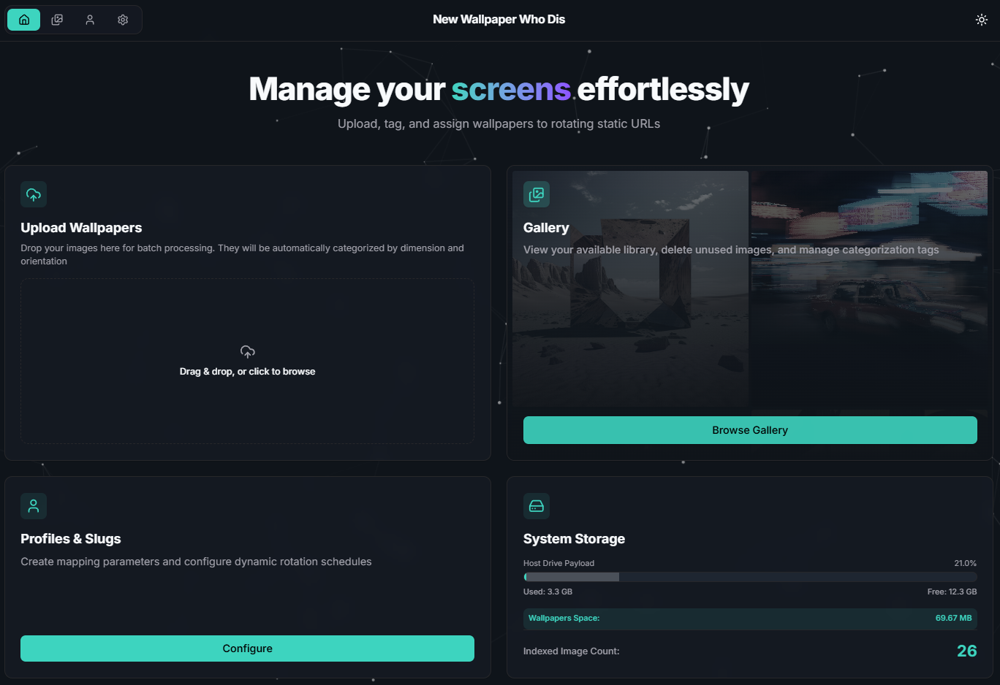
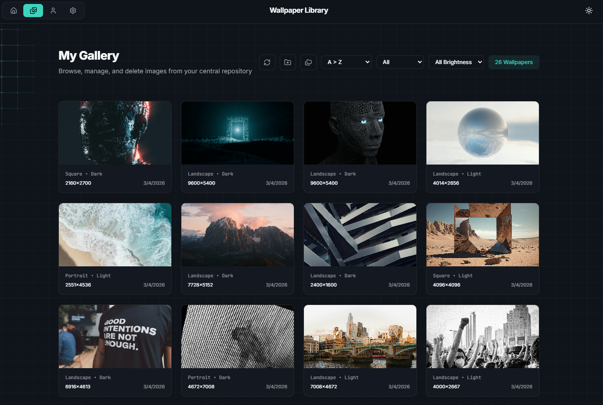
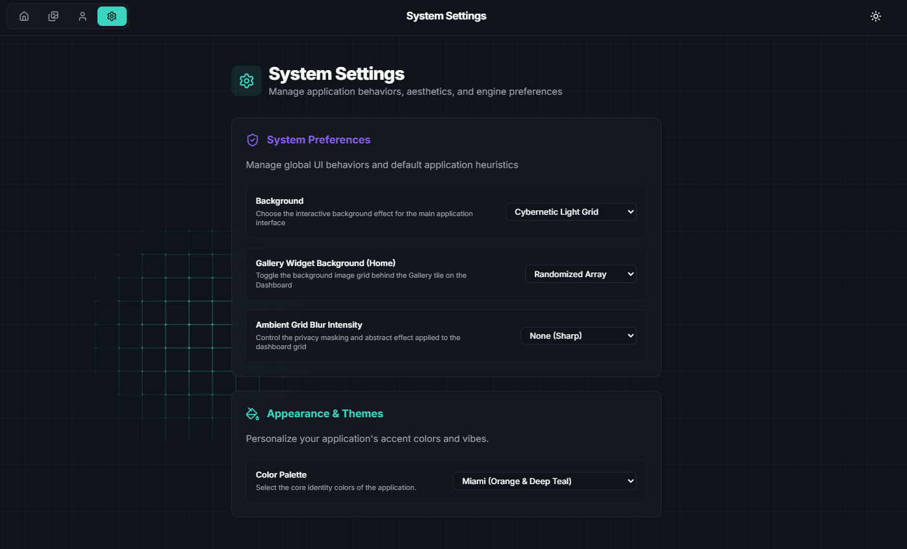

# New Wallpaper Who Dis

**New Wallpaper Who Dis** is a lightweight, self hosted wallpaper management server and dynamic rotation engine. Built on a zero maintenance "flat file" architecture, it allows you to manage massive wallpaper collections simply by dropping images into a directory.

The system automatically scans your files, processes critical metadata (like aspect ratio, orientation, and luminosity), and serves them to your devices via fully customized rotation profiles. 

**Set It and Forget It**: Transform any endpoint (Raspberry Pi, old iPad, Smart TV) into a dynamic digital canvas with zero configuration on the device itself. Simply point the endpoint's browser to your custom URL, and manage multiple displays remotely from a friendly, easy to use **Single Pane of Glass** web UI. No more complex database configurations, manual tagging, or touching the physical displays when you want to change images. Just drag, drop, and let the engine curate your screens.

## Display Kiosks & Dumb Terminal Backups (New in v0.5)

The `/display/[slug]` endpoint goes beyond serving raw images by wrapping your profiles in a fully interactive, GPU accelerated Web Player. 

- **Cinematic Transitions:** Fades, slide ins, and Ken Burns panning effects natively rendered in browser.
- **HUD Widget Engine:** Overlay a transparent 3x3 grid containing live OpenWeatherMap conditions, local clocks, geolocations, and freeform text messages natively onto your visual rotation.
- **The "Dumb Terminal" Backup:** Don't have a modern tablet? No problem. If you point a legacy smart TV, a low power e-Ink display, or a locked down browser that disables JavaScript completely to your Kiosk URL, the server instantly detects the failure and gracefully falls back to injecting raw `<meta http-equiv="refresh">` HTML elements into the page header. This ensures your endpoint will physically force restart and rotate your wall art safely forever, no matter how "dumb" the terminal is!

## Screenshots

### Home


### Gallery


### Settings


## Minimum Hardware Requirements

Thanks to the flat file architecture and Next.js static asset serving, **New Wallpaper Who Dis** is exceptionally lightweight. It does not require a traditional relational database (like PostgreSQL or MySQL).

*   **LXC (Linux Container):** 1 Core, 256MB RAM (Recommended for Proxmox users)
*   **VM (Virtual Machine):** 1 vCPU, 512MB RAM

## Running the application

To run New Wallpaper Who Dis, you will need **Docker** installed on your system. If you do not have Docker yet, download and install the appropriate version for your Operating System:
- [Docker Desktop for Mac](https://docs.docker.com/desktop/install/mac-install/)
- [Docker Desktop for Windows](https://docs.docker.com/desktop/install/windows-install/)
- [Docker Engine for Linux](https://docs.docker.com/engine/install/)

Once Docker is running, the absolute easiest way to deploy the platform is by downloading the preconfigured [docker-compose.yml](https://raw.githubusercontent.com/upioneer/NewWallpaperWhoDis/main/docker-compose.yml) file. You do not need to download or compile the full source code manually.

1. Download the [`docker-compose.yml`](https://raw.githubusercontent.com/upioneer/NewWallpaperWhoDis/main/docker-compose.yml) file and save it into a new, empty folder on your machine.
2. Open your terminal or command prompt, navigate into that folder, and run:

```bash
docker-compose up -d
```

The application will be accessible locally at `http://localhost:6767`.

*Note: Data and uploaded wallpapers are persisted locally in the `./data` and `./wallpapers` directories.*

### Reverse Proxy Setup (Public Access)

If you intend to expose the service to the internet, it is highly recommended to run the container behind a Reverse Proxy like **Nginx Proxy Manager (NPM)**, Traefik, or Cloudflare Tunnels to handle SSL/HTTPS.

1. First, point your domain's DNS (e.g., `wallpaper.yourdomain.com`) to your server's IP address.
2. Ensure your reverse proxy is connected to the same Docker network as this application, or simply forward traffic to port `6767` on the host machine.
3. Pass standard headers (e.g., `Host`, `X-Forwarded-For`, `X-Forwarded-Proto`) in your proxy settings to ensure Next.js routing functions securely over HTTPS.

## Troubleshooting

### Proxmox LXC Permission Denied Error (`net.ipv4.ip_unprivileged_port_start`)

If you are hosting this Docker container inside an **Unprivileged Proxmox LXC Container**, you may experience a fatal crash during `docker-compose up -d` returning this specific OCI runtime error: 
`open sysctl net.ipv4.ip_unprivileged_port_start file: reopen fd 8: permission denied`

**The Cause:** A recent security patch for `containerd.io` (specifically version `1.7.28-2` patching CVE-2025-52881) broke Docker compatibility with Proxmox AppArmor profiles. Unprivileged LXC containers will proactively deny the Docker daemon permission to bind internal container networking interfaces.

**The Fix:** You must downgrade `containerd.io` inside your LXC container to a version prior to `1.7.28-2` (such as `1.7.28-1` or `1.7.24-1`) until an upstream patch is released by the Docker team.

1. Check your available package versions:
   `sudo apt-cache policy containerd.io`
2. Force install the stable version (replace with your specific distribution suffix):
   `sudo apt install --allow-downgrades containerd.io=1.7.28-1~ubuntu.24.04~noble`
3. Restart the Docker daemon and spin the container back up:
   `sudo systemctl restart docker && sudo docker compose up -d`

## Architecture & Resiliency

This project is built on a **Flat File Architecture**, prioritizing simplicity, maintenance free operation, and platform agnosticism. 

- **Drag and Drop Maintenance**: The `/wallpapers` folder on your hard drive is the ultimate source of truth. You don't need to use the web application to manage your library. You can literally drag hundreds of files directly into the folder via Windows Explorer, macOS Finder, or an FTP client. When the app boots or receives a request, the background Auto Sync crawler automatically discovers, measures, and safely ingests any new files into the gallery web UI.
- **Aggressive Purging**: Unsupported files (e.g. PDFs, TXT, or EXEs) dropped into the folder are aggressively purged by the synchronization engine to prevent bloat and security footprint expansion.
- **Disposable Database Cache**: The internal `/data/db.json` database acts strictly as a high speed cache for tracking advanced image metadata (like dominant color schemas and orientation tags) to prevent reprocessing identical files. **If this file is manually deleted or corrupted, the app will gracefully recover without crashing**. It instantly rebuilds a fresh database skeleton, and the Auto Sync crawler automatically repopulates all dimensions and tags by rescanning the physical disk.

## Licensing & Default Assets

The core codebase is licensed under the terms described in (`license.md`). The  default wallpapers included upon installation to provide a softer onboarding experience are all royalty free and generously captured by creators on Unsplash. Please refer to [`LICENSE-ASSETS.md`](./LICENSE-ASSETS.md) for full image attribution and links to the original artists.
